# 新浪体育新闻分类与可视化展示

## 1 引言

### 1.1 选题

我们小组选择的题目是 新浪体育新闻数据分析。

 要求如下：

1、针对新浪体育编写采集程序采集新浪体育新闻，按类别（足球、篮球、围棋、网球、台球、羽毛球、乒乓球……）采集，每个类别采集1000份。

2、对新闻进行分析，使用贝叶斯或者TF-IDF或者其他深度学习方法进行分类学习

3、以4：1的比例进行训练和测试，使得分类准确性达到92%以上

### 1.2 大致流程

首先，我们小组用Python编写爬虫程序，爬取了新浪体育新闻网站上的五个类别的体育新闻的url，每类新闻都采集了1000个url。

然后，我们创建了数据库和表结构，再按照url去爬取具体的新闻数据放入数据库的表中。

我们构建神经网络模型对收集到的数据进行分类学习，让分类准确率超过了95%。

最后，我们添加了界面可视化部分，提供基于模型的分类预测和基于模糊匹配的简单搜索功能。

## 2 数据获取

### 2.1 获取所有新闻的url

首先，确定要搜集的五个新闻类别，为了方便之后的数据爬取，因此尽量挑选五个网页结构相似，且爬取相对容易的类别。这里确定的五个类别分别为：羽毛球、乒乓球、拳击、台球、排球。下面展示一下这五种类别的网页结构。以羽毛球为例。

这五种类别都能找到滚动新闻网。（篮球、足球等新闻的网站做了专门的设计，本人暂时没有找到类似的网页）

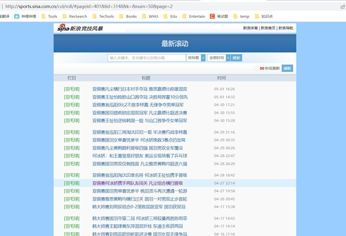

点击滚动新闻网的一条新闻，可以跳转到如下界面


因此我们得到的爬虫思路是，首先通过某一类别的滚动新闻网获取若干可以跳转的该类别的url，在获得大量的url之后，再统一爬取这些url对应的网页，解析这些网页，将关心的数据存入数据库。

那么首先需要获取所有新闻的url，我们仍然以羽毛球类为例，先对羽毛球类的滚动新闻网进行抓包分析。

羽毛球类滚动新闻网对应的网址为 http://sports.sina.com.cn/col/roll/#pageid=401&lid=3148&k=&num=50&page=1，
进入浏览器开发者模型，我们发现请求的html界面中并没有超链接标签，因此url数据并不是直接加载到html中。

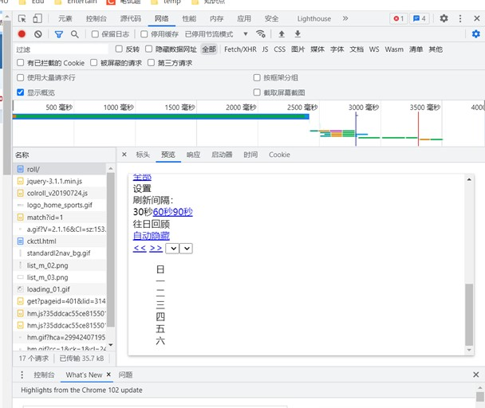

通过抓包发现，一个js文件中看起来似乎有我们需要的url数据，如下图所示

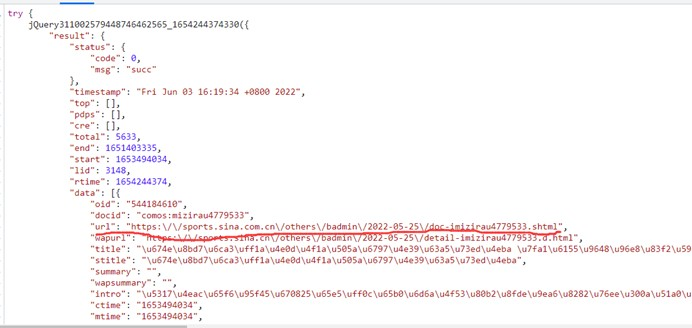

经过测试后，该url果然是对应了一条新闻的网页，该js文件中有50个url,分析该js文本的请求地址，我们分析得出pageid和lid参数对应了某个体育类别，num=50代表了返回的数据条数为50条，page代表页数。

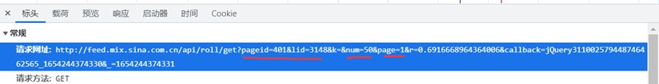

由此我们只要更改每个请求地址的page参数，就可以获得若干js文本，每个js文本都封装了50个对应新闻的url。

**获取全部新闻url的代码实现：get_urls.py**

```python
import requests #用来爬虫
import json #用来存储url数据
import threading #用来实现多线程爬虫
#定义请求头，将程序伪装成浏览器
headers = {
    'User-Agent': 'Mozilla/5.0 (Windows NT 10.0; Win64; x64) AppleWebKit/537.36 (KHTML, like Gecko) Chrome/101.0.4951.67 Safari/537.36'
}
#通过浏览器开发者模式分析得到请求数据的地址
url_map = {
    'badminton': ('http://feed.mix.sina.com.cn/api/roll/get?pageid=401&lid=3148&k=&num=50&page=',
                  '&callback=jQuery311046318045989729484_1653008481111&_=1653008481112'),
    'volleyball': ('http://feed.mix.sina.com.cn/api/roll/get?pageid=401&lid=2556&k=&num=50&page=',
                   '&callback=jQuery31107792551261400134_1653633713754&_=1653633713755'),
    'boxing': ('http://feed.mix.sina.com.cn/api/roll/get?pageid=401&lid=3158&k=&num=50&page=',
               '&callback=jQuery311045028227637724094_1653634819975&_=1653634819976'),
    'snooker': ('http://feed.mix.sina.com.cn/api/roll/get?pageid=401&lid=3164&k=&num=50&page=',
                '&callback=jQuery31102677159132546345_1653635002868&_=1653635002869'),
    'pingpang': ('http://feed.mix.sina.com.cn/api/roll/get?pageid=13&lid=2557&k=&num=50&page=',
                 '&callback=jQuery31106235599297338865_1653635174293&_=1653635174294')

}
#使用多线程方式爬取
thread_list = []

#该函数用来爬取某种体育类型的url，如果将Thread的target参数指向该函数，线程启动时就会自动指行该函数。
def process(sport_type, url_tutle):
    url_list = []
    for page in range(25):
        #page从1到25递增
        url = url_tutle[0] + str(page+1) + url_tutle[1]
        res = requests.get(url=url, headers=headers)
        #获得请求的js文本
        text = res.text
        #需要的数据在js文本的函数的参数中，是js中以{}封装的对象
        #找到对象的开始位置
        start = text.find('{"result')
        #文本是一个try catch函数，末尾固定
        json_obj = text[start:-14]
        #data是result对象的一个属性，是一个数组
        data = json.loads(json_obj)['result']['data']
        #data一般封装了50条数据，数据的url属性即我们要找的url
        for i in range(len(data)):
            url_list.append(data[i]['url'])
    #path为存储路径
    path = sport_type + '_url.json'
    f = open(path, 'w')
    #保存url数据到json文件中
    json.dump(url_list, f)
    f.close()
    print(sport_type+":url获取成功！")

for key, value in url_map.items():
    #创建一个新线程
    thread = threading.Thread(target=process,args=[key,value])
    #启动线程
    thread.start()
    thread_list.append(thread)

#防止主线程提前关闭
for thread in thread_list:
    thread.join()

```

执行该段代码后，我们得到如下json文件。

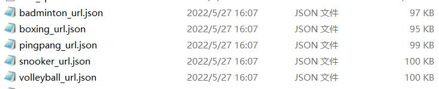

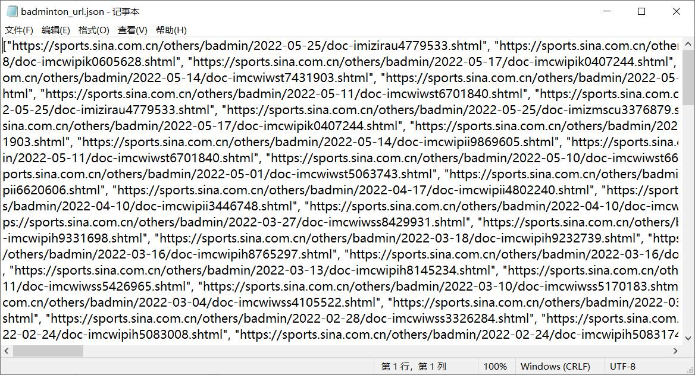


### 2.2 选择数据库和建表

本项目选择使用sqlite数据库来存储数据，原因是该数据库是一种轻型数据库，而本项目涉及到的数据不超过一万条，因此该数据库已经足够满足需求了。此外，该数据库无需安装和管理配置，使用起来非常的轻便，而且存储数据的方式还是基于文件系统的，小组成员共享数据时直接传递文件即可查看，不需要复杂的导入导出操作。

选择好数据库后，使用python程序建立数据库和数据表，一共建立五张数据表，每张表对应一个体育类别，表结构相同，都有id，title,date,keywords,description,artibody六个字段。

**创建数据库和数据表的代码实现：create_database.py**

```python
import sqlite3
#有则连接，没有则先创建再连接
conn= sqlite3.connect("sina_sports.db")#创建并连接数据库students.db
cursor = conn.cursor()
#五个要建立的数据表
sports=['badminton','boxing','pingpang','snooker','volleyball']
for sport in sports:
    try:
        #建表的SQL语句，表结构如下所示
        create_tb_cmd = '''
            CREATE TABLE IF NOT EXISTS %s(
            id varchar(20) primary key,
            title varchar(255),
            date varchar(64),
            keywords varchar(255),
            description text ,
            artibody text 
            );
        ''' %sport
        cursor.execute(create_tb_cmd)
    except:
        print("Create table badminton failed")
cursor.close()
conn.close()
```

创建完成后，使用Navicat软件查看，如下图，可见五张表都创建成功了。

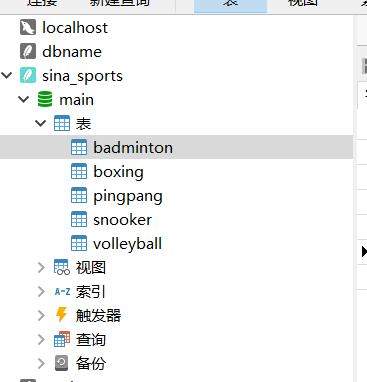

查看其中一张表的表结构，也没有问题。

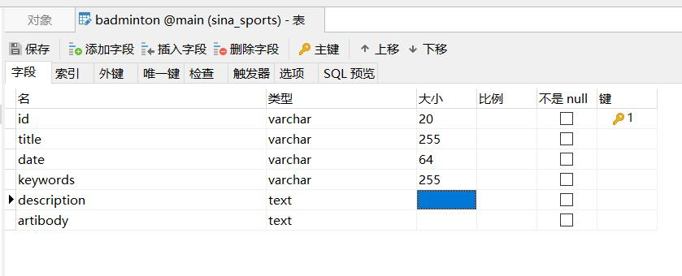


### 2.3 爬取、解析和存储新闻数据

在2.1中，我们已经获取到了所有网页的url，并将它们存储到json文件中，因此这一步我们需要做的就是通过url找到对应的网页，然后解析网页，将所需信息存储在2.2过程创建的表中。

首先，我们先根据一个url查看对应网页，观察网页结构。

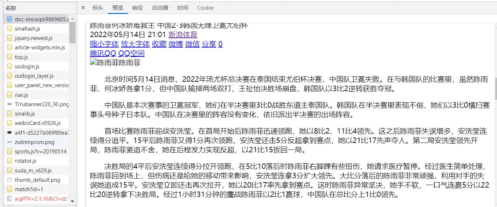

通过浏览器开发者模式抓包，我们发现新闻的文本信息就在请求的html文本中。接下来分析数据在html文本的位置。

如下图所示，title数据在\<meta property="og:title"/>标签中，keywords数据在\<meta name="keywords">标签中，description数据在\<meta name="dedcription">标签中。

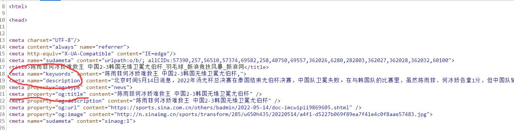

如下图，date数据在\<span class="date">\</span>标签中。

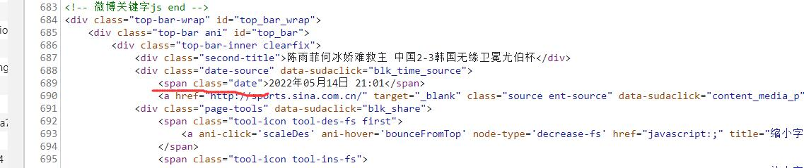

如下图，artibody数据在\<div class="article" id="artibody" >下的<p></p>标签中。

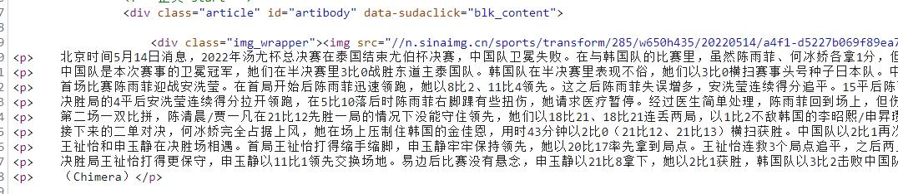

知道了数据在html文档中的分布，我们就可以对数据进行解析了，这里使用的是xpath解析方法，该方法通过xpath表达式来获取xml文档下的节点。

**爬取、解析和存储新闻数据的代码实现：crawl_pages.py**

```python
import requests
import json
import sqlite3
from lxml import etree #用于解析xml文档
import threading

headers = {
    'User-Agent': 'Mozilla/5.0 (Windows NT 10.0; Win64; x64) AppleWebKit/537.36 (KHTML, like Gecko) Chrome/101.0.4951.67 Safari/537.36'
}
# 给每个运动都分配一个序号，该运动的id的开头都为该序号
sports = [(1, 'badminton'),
          (2, 'pingpang'),
          (3, 'boxing'),
          (4, 'snooker'),
          (5, 'volleyball')]
conn = sqlite3.connect("sina_sports.db", check_same_thread=False)

#定义线程的处理函数，order代表序号，sport代表运动类型
def process(order, sport):
    cursor = conn.cursor()
    path = sport + '_url.json'
    fr = open(path)
    #sport_urls用于为从json文件中加载得到的列表，存放某个运动类型新闻的url
    sport_urls = json.load(fr)
    fr.close()
    #用num来记录sport_urls的索引
    num = 0
    #index为了生成数据表中一条记录的id值，index代表偏移量
    #id计算方法：运动类别序号*100000+index
    index = 0
    #completed代表已经爬取到的记录数。
    completed = 0
    for url in sport_urls:
        num += 1
        # 排除开头不一致的网页，因为这些网页的结构可能不同，导致解析失败
        if (not url.startswith("https://sports.sina.com.cn")): continue
        # index为每条数据id偏移量
        index += 1
        try:
            res = requests.get(url=url, headers=headers)
            #防止中文乱码
            res.encoding = 'utf-8'
			#将html文本转化成etree对象后才能进行xpath解析
            tree = etree.HTML(res.text)
            try:
                #获取新闻标题
                title = tree.xpath('/html/head/meta[@property="og:title"]')[0].get('content')
                #获取日期时间
                date = tree.xpath('//span[@class="date"]')[0].text
                #获取新闻关键词
                keywords = tree.xpath('/html/head/meta[@name="keywords"]')[0].get('content')
                #获取新闻描述
                description = tree.xpath('/html/head/meta[@name="description"]')[0].get('content')
                paras = tree.xpath('//div[@id="artibody"]/p')
                artibody = ""
                #获取新闻全文
                for para in paras:
                    para_text = para.text
                    if (para_text): artibody += para_text.strip() + '\n'

                # order*100000为id的基址，index为id的偏移地址
                str_id = str(order * 100000 + index)
                sql = "insert into %s " \
                      "(id,title,date,keywords,description,artibody) " \
                      "values('%s','%s','%s','%s','%s','%s') " % \
                      (sport, str_id, title, date, keywords, description, artibody)
                cursor.execute(sql)
                completed += 1
                if (completed % 50 == 0): print(sport + '：已经存储了' + str(completed) + "条数据！")
            except Exception as e:
                print(sport + '：第' + str(num) + '个网页解析失败！')
                print(sport+":"+e)

        except:
            print(sport + '：第' + str(num) + '个网页爬取失败！')
    cursor.close()
    try:
        conn.commit()
        print(sport+':提交成功！')
    except:
        print(sport+':提交失败')


thread_list = []
#使用多线程并发爬取和解析数据，同时爬取和解析五个体育类别新闻。
for order, sport in sports:
    thread = threading.Thread(target=process, args=[order, sport])
    thread.start()
    thread_list.append(thread)
for thread in thread_list:
    thread.join()

conn.close()
```

使用Navicat查看数据库


## 3 模型构建

对于多分类问题，使用神经网络模型是一种较好的解决方案。

经过小组成员的尝试，我们发现，在我们所构建的神经网络模型中，如果输入层仅仅只是将句子进行分词以及将词转化为数字索引就直接放入输入层的话，模型在训练过程中准确率甚至难以突破40%，原因在于如果只是将每个词转化为对应的索引，会丢失非常多这个词代表的含义信息。

这个时候我们想到如果能够将每个词转换为词向量，即使用word2vec技术，那么就能保留词的信息。因此，我们对原来的神经网络增添Embedding层，模型分类的准确率果然大幅度提高，训练后准确率可以超过95%。

**模型构建的代码具体实现：model.ipynb**

```python
#用到的包
import jieba #用于中文分词
import sqlite3 #用于数据库操作
import random #用于打乱数据
from keras.models import Sequential #keras模块用于模型构建
from keras.layers import Embedding, LSTM, Dense, Dropout
import keras
from keras import optimizers
import numpy as np #用于处理数组
```

### 3.1 数据加载和预处理

```python
sport_to_label_map={
    'badminton':1,
    'pingpang':2,
    'boxing':3,
    'snooker':4,
    'volleyball':5
}
#该函数用于加载和打乱数据
#path：数据库路径
#mapper：字典，mapper的key为表名，value为类别标签
#return：data为一个列表，每个元素是一篇新闻（标题+正文），labels是该新闻对应的类别标签
def load_and_shuffle_data(path,mapper):
    conn = sqlite3.connect(path)
    cursor = conn.cursor()
    data = []
    labels = []
    for k,v in mapper.items():
        sql = "SELECT title,artibody FROM " + k
        res = cursor.execute(sql)
        restext=res.fetchall()
        for i in range(len(restext)):
            data.append(restext[i][0]+' '+restext[i][1])
            labels.append(v)
    #random.shuffle函数可以打乱一个列表，我们需要使data和labels两个列表同步乱序
    #即二者打乱顺序后依然能一一对应，只需要在使用random模块对data乱序前获取state值，
    #然后对两个列表乱序使使用相同的state即可
    state = random.getstate()
    random.shuffle(data)
    random.setstate(state)
    random.shuffle(labels)
    cursor.close()
    conn.close()
    return data,labels

#该函数用于将一段句子转化为长度为128的列表
#sentence：句子文本
#word_index：字典{key：单词，value：单词对应的索引}
#return：长度为128的列表，元素是句子中每个词对应的索引，长度不够则末尾补零
def sentence_to_indexs(sentence,word_index,max_lenth=128):
    #jieba用来分词
    seg_list=list(jieba.cut(sentence))
    res_list=[]
    length=len(seg_list)
    if(length>max_lenth):
        for i in range(max_lenth):
            try:
                res_list.append(word_index[seg_list[i]])
            except:
                res_list.append(0)
    else:
        for word in seg_list:
            try:
                res_list.append(word_index[word])
            except:
                res_list.append(0)
        diff = max_lenth - length
        for i in range(diff):
            res_list.append(0)
    return res_list

#该函数用来将所有新闻一一进行文本转单词索引操作
#data：列表，每个元素是一条新闻
#word_index：同上
#return：返回一个numpy形式的二维数组
def pre_process_data(data,word_index):
    res_data = []
    for sentence in data:
        res_data.append(sentence_to_indexs(sentence,word_index))
    return np.array(res_data)

#将标签类别转化为one-hot向量，例如，对于类别总数为5，1->[1,0,0,0,0]，3->[0,0,1,0,0]
#labels：即原始标签列表
#return：返回以numpy形式的二维数组，每个label是一个one-hot向量
def pre_process_label(labels):
    res_arr = np.zeros(shape=(len(labels),5))
    for i in range(len(labels)):
        res_arr[i][labels[i]-1]=1
    return np.array(res_arr)

#将数据和标签划分为两部分，比如训练集和测试集
def split_data(data,labels,proportion=0.7):
    train_len = int(len(data)*proportion)
    train_x = data[:train_len]
    train_y = labels[:train_len]
    test_x = data[train_len:]
    test_y = labels[train_len:]
    return train_x,train_y,test_x,test_y
```

### 3.2 引入word2vec模型

word2vec模型下载地址：https://github.com/Embedding/Chinese-Word-Vectors，本项目使用的是用中文维基百科作为语料训练的词向量模型，词向量维度为300。

```python
myPath = 'sgns.wiki.word' # 本地词向量的地址
Word2VecModel = gensim.models.KeyedVectors.load_word2vec_format(myPath)# 读取词向量
word_index = {" ": 0}# 初始化 `[word : token]` ，后期 tokenize 语料库就是用该词典。
# 初始化存储所有向量的大矩阵，留意其中多一位（首行），词向量全为 0，用于 padding补零。
# 行数为所有单词数+1 比如 10000+1 ； 列数为词向量“维度”比如300。
embeddings_matrix = np.zeros((len(Word2VecModel.index_to_key) + 1, Word2VecModel.vector_size))
for i in range(len(Word2VecModel.index_to_key)):
    word = Word2VecModel.index_to_key[i]  # 每个词语
    word_index[word] = i + 1 # 词语：序号
    embeddings_matrix[i + 1] = Word2VecModel[word]  # 词向量矩阵
# 保存用于将词语转为索引的词典，
#embedding_matrix词向量矩阵会保存在模型中，因此这里不需要保存
np.save('word_to_index.npy',word_index)

```

### 3.3 模型构建

```python
MAX_SEQUENCE_LENGTH = 128
EMBEDDING_DIM = 300
model = Sequential()
model.add(Embedding(input_dim = len(embeddings_matrix), # 字典长度
                    output_dim = EMBEDDING_DIM, # 词向量维度（300）
                    weights=[embeddings_matrix], # 预训练的词向量系数
                    input_length=MAX_SEQUENCE_LENGTH, # 句子长度 
                    trainable=False # 是否在训练的过程中更新词向量
                   ))
model.add(LSTM(128, activation='tanh'))
model.add(Dropout(0.5))
model.add(Dense(64, activation='relu'))
model.add(Dropout(0.5))
model.add(Dense(32, activation='sigmoid'))
model.add(Dense(5 , activation='softmax'))
adam = optimizers.adam_v2.Adam(learning_rate=0.01,decay=1e-6)#学习率为0.01，学习率衰减系数为1e-6
model.compile(loss='categorical_crossentropy',
              optimizer=adam,
              metrics=['accuracy'])
model.summary()
```

out:

```
Model: "sequential_2"
_________________________________________________________________
 Layer (type)                Output Shape              Param #   
=================================================================
 embedding_1 (Embedding)     (None, 128, 300)          105665400 
                                                                 
 lstm_1 (LSTM)               (None, 128)               219648    
                                                                 
 dropout_2 (Dropout)         (None, 128)               0         
                                                                 
 dense_2 (Dense)             (None, 64)                8256      
                                                                 
 dropout_3 (Dropout)         (None, 64)                0         
                                                                 
 dense_3 (Dense)             (None, 32)                2080      
                                                                 
 dense_4 (Dense)             (None, 5)                 165       
                                                                 
=================================================================
Total params: 105,895,549
Trainable params: 230,149
Non-trainable params: 105,665,400
_________________________________________________________________
```

下面对用到的层进行解释

- Embedding层：将正整数（下标）转换为具有固定大小的向量，如[[4],[20]]->[[0.25,0.1],[0.6,-0.2]]，Embedding层只能作为模型的第一层

- LSTM层：Keras长短期记忆模型，简单介绍见下
- Dense: 全连接层
- Dropout层：每次更新参数的时候随机断开一定百分比(b)的输入神经元连接，用于防止过拟合

LSTM模型结构：


LSTM模型简介：

LSTM（Long Short-Term Memory）是长短期记忆网络，是一种时间递归神经网络（RNN），主要是为了解决长序列训练过程中的梯度消失和梯度爆炸问题。简单来说，就是相比普通的RNN，LSTM能够在更长的序列中有更好的表现。 LSTM 已经在科技领域有了多种应用。基于 LSTM 的系统可以学习翻译语言、控制机器人、图像分析、文档摘要、语音识别图像识别、手写识别、控制聊天机器人、预测疾病、点击率和股票、合成音乐等等任务。

LSTM区别于RNN的地方，主要就在于它在算法中加入了一个判断信息有用与否的“处理器”，这个处理器作用的结构被称为cell。一个cell当中被放置了三扇门，分别叫做输入门、遗忘门和输出门。一个信息进入LSTM的网络当中，可以根据规则来判断是否有用。只有符合算法认证的信息才会留下，不符的信息则通过遗忘门被遗忘。


### 3.4 模型训练

```python
history=model.fit(train_x, train_y,
          epochs=20,
          batch_size=128,
          verbose=1,
          validation_data =(test_x,test_y)
         )
```

out:

```markdown
Epoch 1/20
28/28 [==============================] - 12s 339ms/step - loss: 1.6074 - accuracy: 0.2425 - val_loss: 1.5848 - val_accuracy: 0.2992
Epoch 2/20
28/28 [==============================] - 9s 316ms/step - loss: 1.5117 - accuracy: 0.3290 - val_loss: 1.3686 - val_accuracy: 0.3821
Epoch 3/20
28/28 [==============================] - 9s 333ms/step - loss: 1.3275 - accuracy: 0.4475 - val_loss: 1.1681 - val_accuracy: 0.5310
Epoch 4/20
28/28 [==============================] - 9s 332ms/step - loss: 1.0879 - accuracy: 0.5486 - val_loss: 0.9681 - val_accuracy: 0.5898
Epoch 5/20
28/28 [==============================] - 9s 337ms/step - loss: 0.9025 - accuracy: 0.6155 - val_loss: 0.8548 - val_accuracy: 0.6107
Epoch 6/20
28/28 [==============================] - 10s 345ms/step - loss: 0.7823 - accuracy: 0.6514 - val_loss: 0.7559 - val_accuracy: 0.6355
Epoch 7/20
28/28 [==============================] - 10s 341ms/step - loss: 0.7045 - accuracy: 0.6670 - val_loss: 0.7102 - val_accuracy: 0.6590
Epoch 8/20
28/28 [==============================] - 9s 339ms/step - loss: 0.6718 - accuracy: 0.6886 - val_loss: 0.5233 - val_accuracy: 0.7655
Epoch 9/20
28/28 [==============================] - 10s 350ms/step - loss: 0.5084 - accuracy: 0.7575 - val_loss: 0.4557 - val_accuracy: 0.7845
Epoch 10/20
28/28 [==============================] - 10s 344ms/step - loss: 0.4203 - accuracy: 0.8188 - val_loss: 0.3432 - val_accuracy: 0.8877
Epoch 11/20
28/28 [==============================] - 9s 340ms/step - loss: 0.3537 - accuracy: 0.8863 - val_loss: 0.2977 - val_accuracy: 0.9151
Epoch 12/20
28/28 [==============================] - 9s 340ms/step - loss: 0.3059 - accuracy: 0.9048 - val_loss: 0.2905 - val_accuracy: 0.9223
Epoch 13/20
28/28 [==============================] - 9s 334ms/step - loss: 0.2231 - accuracy: 0.9345 - val_loss: 0.2028 - val_accuracy: 0.9510
Epoch 14/20
28/28 [==============================] - 9s 332ms/step - loss: 0.1593 - accuracy: 0.9560 - val_loss: 0.1968 - val_accuracy: 0.9458
Epoch 15/20
28/28 [==============================] - 9s 328ms/step - loss: 0.1781 - accuracy: 0.9555 - val_loss: 0.2637 - val_accuracy: 0.9327
Epoch 16/20
28/28 [==============================] - 9s 330ms/step - loss: 0.1714 - accuracy: 0.9577 - val_loss: 0.2106 - val_accuracy: 0.9451
Epoch 17/20
28/28 [==============================] - 9s 339ms/step - loss: 0.1581 - accuracy: 0.9580 - val_loss: 0.2264 - val_accuracy: 0.9438
Epoch 18/20
28/28 [==============================] - 9s 332ms/step - loss: 0.1477 - accuracy: 0.9639 - val_loss: 0.2107 - val_accuracy: 0.9491
Epoch 19/20
28/28 [==============================] - 9s 331ms/step - loss: 0.1090 - accuracy: 0.9714 - val_loss: 0.1874 - val_accuracy: 0.9530
Epoch 20/20
28/28 [==============================] - 9s 333ms/step - loss: 0.0963 - accuracy: 0.9759 - val_loss: 0.1777 - val_accuracy: 0.9575
```

可视化展示训练过程：

```python
# 损失绘图
import matplotlib.pyplot as plt
history_dict = history.history
loss_values = history_dict["loss"]
val_loss_values = history_dict["val_loss"]
epochs = range(1,len(loss_values) + 1)  
# 训练
plt.plot(epochs,  #  横坐标
         loss_values,  # 纵坐标
         "r",  # 颜色和形状，默认是实线
         label="Training_Loss"  # 标签名
        )
# 验证
plt.plot(epochs,
         val_loss_values,
         "b",
         label="Validation_Loss"
        )
plt.title("Training and Validation Loss")
plt.xlabel("Epochs")
plt.ylabel("Loss")
plt.legend()
plt.show()
```

out:

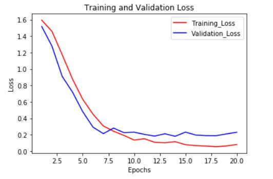

```python
history_dict = history.history
acc_values = history_dict["accuracy"]  # 修改：原文是acc ---> accuracy
val_acc_values = history_dict["val_accuracy"]   # val_acc ---> val_accuracy
epochs = range(1,len(loss_values) + 1)
plt.plot(epochs,
         acc_values,
         "r",
         label="Training_ACC"
        )
plt.plot(epochs,
         val_acc_values,
         "b",
         label="Validation_ACC"
        )
plt.title("Training and Validation ACC")
plt.xlabel("Epochs")
plt.ylabel("acc")
plt.legend()
plt.show()
```

out:

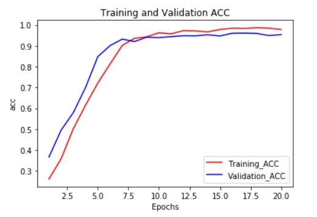

测试结果：

```python
model.evaluate(test_x,test_y, batch_size=128)
```

out:

```
12/12 [==============================] - 2s 125ms/step - loss: 0.1777 - accuracy: 0.9575
```

在测试集上准确率达到了95%以上，基本满足了要求。

## 4 程序封装和可视化

### 4.1 可视化界面ui代码

导入库

```python
from PySide2.QtCore import *
from PySide2.QtGui import *
from PySide2.QtWidgets import *
import sys, time, os
import re
import pymysql
```

由于设计的可视化界面中有预测分类、搜索两个模块，所以我们选择用QTabWidget来设置两个分页tab，分别是分类tab和搜索tab。

```python
class Ui_Form(object):
    def setupUi(self, Form):
        if not Form.objectName():
            Form.setObjectName(u"Form")
        Form.resize(818, 869)
        # 选用tab来分割Form
        self.tabWidget = QTabWidget(Form)

```

分类页面ui代码如下所示：

```python
		# 分类页面
        self.tabWidget.setObjectName(u"tabWidget")
        self.tabWidget.setGeometry(QRect(0, -1, 821, 801))
        self.tab = QWidget()
        self.tab.setObjectName(u"tab")

        #分类页面中的新闻文本输入
        self.newsInput = QPlainTextEdit(self.tab)
        self.newsInput.setObjectName(u"newsInput")
        self.newsInput.setGeometry(QRect(20, 100, 771, 301))
        self.newsInput.setOverwriteMode(True)
        self.newsInput.setTabStopWidth(128)
        self.newsInput.setBackgroundVisible(False)
        self.newsInput.setCenterOnScroll(False)

        #预测分类按钮
        self.pushButtonClassify = QPushButton(self.tab)
        self.pushButtonClassify.setObjectName(u"pushButtonClassify")
        self.pushButtonClassify.setGeometry(QRect(20, 410, 121, 51))

        #展示预测结果
        self.newsCategory = QTextBrowser(self.tab)
        self.newsCategory.setObjectName(u"newsCategory")
        self.newsCategory.setGeometry(QRect(160, 410, 631, 51))
        self.label = QLabel(self.tab)
        self.label.setObjectName(u"label")
        self.label.setGeometry(QRect(20, 60, 201, 41))
        self.label.setScaledContents(False)
        self.label.setWordWrap(False)
```

分类页面可视化界面如图所示：

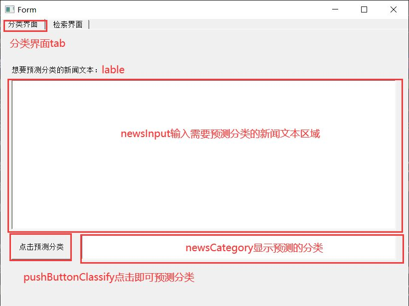

搜索分页代码如下：

```python
 # 第二个搜索页面
        self.tabWidget.addTab(self.tab, "")
        self.tab_2 = QWidget()
        self.tab_2.setObjectName(u"tab_2")

        # 搜索的输入文本框
        self.searchInputL = QLineEdit(self.tab_2)
        self.searchInputL.setObjectName(u"searchInputL")
        self.searchInputL.setGeometry(QRect(20, 60, 631, 51))
        self.searchInputL.setAutoFillBackground(False)
        # 文本搜索的按钮
        self.pushButtonSearchL = QPushButton(self.tab_2)
        self.pushButtonSearchL.setObjectName(u"pushButtonSearchL")
        self.pushButtonSearchL.setGeometry(QRect(670, 60, 121, 51))
        # 搜索的ID文本框
        self.searchInputID = QLineEdit(self.tab_2)
        self.searchInputID.setObjectName(u"searchInputID")
        self.searchInputID.setGeometry(QRect(20, 130, 631, 51))
        # ID搜索的按钮
        self.pushButtonSearchID = QPushButton(self.tab_2)
        self.pushButtonSearchID.setObjectName(u"pushButtonSearchID")
        self.pushButtonSearchID.setGeometry(QRect(670, 130, 121, 51))
        # 搜索结果部分展示
        self.searchOut = QTextBrowser(self.tab_2)
        self.searchOut.setObjectName(u"searchOut")
        self.searchOut.setGeometry(QRect(20, 230, 771, 640))
        self.tabWidget.addTab(self.tab_2, "")

        self.retranslateUi(Form)

        self.tabWidget.setCurrentIndex(1)

        QMetaObject.connectSlotsByName(Form)
```

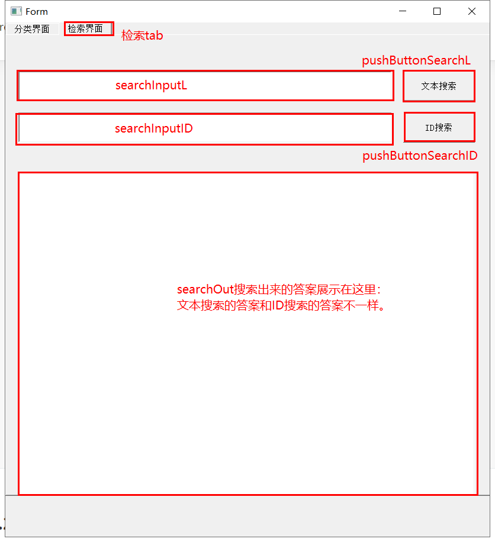

一部分常规功用代码如下：

```python
    def retranslateUi(self, Form):
        Form.setWindowTitle(QCoreApplication.translate("Form", u"Form", None))
        self.newsInput.setPlainText("")
        self.newsInput.setPlaceholderText(QCoreApplication.translate("Form", u"\u8bf7\u8f93\u5165\u60a8\u9700\u8981\u9884\u6d4b\u5206\u7c7b\u7684\u65b0\u95fb\u6587\u672c\u5185\u5bb9\uff0c\u8bf7\u5c3d\u91cf\u4e0d\u8981\u8d85\u8fc7128\u4e2a\u5b57\u3002", None))
        self.pushButtonClassify.setText(QCoreApplication.translate("Form", u"\u70b9\u51fb\u9884\u6d4b\u5206\u7c7b", None))
        self.label.setText(QCoreApplication.translate("Form", u"\u60f3\u8981\u9884\u6d4b\u5206\u7c7b\u7684\u65b0\u95fb\u6587\u672c\uff1a", None))
        self.tabWidget.setTabText(self.tabWidget.indexOf(self.tab), QCoreApplication.translate("Form", u"\u5206\u7c7b\u754c\u9762", None))
        self.pushButtonSearchL.setText(QCoreApplication.translate("Form", u"\u6587\u672c\u641c\u7d22", None))
        self.pushButtonSearchID.setText(QCoreApplication.translate("Form", u"ID\u641c\u7d22", None))
        self.tabWidget.setTabText(self.tabWidget.indexOf(self.tab_2), QCoreApplication.translate("Form", u"\u68c0\u7d22\u754c\u9762", None))
    # retranslateUi
```


### 4.2 可视化界面操作代码

导入库

```python
import sys,os
import numpy as np
from PySide2.QtCore import *
from PySide2.QtGui import *
import jieba
from keras.models import load_model
from PySide2.QtWidgets import *
import PySide2
from classify import Ui_Form
import sqlite3
```

主函数部分代码

```python
if __name__ == "__main__":
    # 连接数据库
	db = 'sina_sports.db'
    con = sqlite3.connect(db)
    cur = con.cursor()
    print(con,cur)
    # QApplication 类管理图形用户界面应用程序的控制流和主要设置
    # 它包含主事件循环，在其中来自窗口系统和其它资源的所有事件被处理和调度。它也处理应用程序的初始化和结束，并且提供对话管理。它也处理绝大多数系统范围和应用程序范围的设置。对于任何一个使用Qt的图形用户界面应用程序，都正好存在一个QApplication对象，而不论这个应用程序在同一时间内是不是有0、1、2或更多个窗口。
    app = QApplication(sys.argv)
    # 调用类MainWindow()生成对象mwin，并调用mwin的show函数
    mwin = MainWindow()
    mwin.show()

    sys.exit(app.exec_())
```

MainWindow类的代码：

```python
class MainWindow(Ui_Form,QMainWindow):
    def __init__(self):
        super(MainWindow,self).__init__()
        self.setupUi(self)
        # 分页界面的预测分类的按钮被点击了就会启动相应的pushClassifyButtonh函数
        self.pushButtonClassify.clicked.connect(self.pushClassifyButton)
        # 搜素界面的ID搜索按钮被点击了就会启动相应的pushIDButton函数
        self.pushButtonSearchID.clicked.connect(self.pushIDButton)
        # 搜素界面的文本搜索按钮被点击了就会启动相应的pushLButton函数
        self.pushButtonSearchL.clicked.connect(self.pushLButton)
        # 这里加载了我们的模型和对应的word_to_index文件
        self.model = load_model('mode2.h5')
        self.word_to_index = np.load('word_to_index.npy',allow_pickle=True).item()


    # 按分类按钮
    def pushClassifyButton(self):
        index2result={
            1:'羽毛球',
            2:'乒乓球',
            3:'拳击',
            4:'台球',
            5:'排球'
        }
        # 获取输入文本
        text = self.newsInput.toPlainText()
        
        # 输入文本按照模型处理后预测出的分类
        input_vec = np.array(sentence_to_indexs(text,self.word_to_index)).reshape(1,128)
        output = self.model.predict(input_vec)
        print(output)
        ans = np.argmax(output)+1
        pre = index2result[ans]
        
        #将预测的分类展示出来
        self.newsCategory.setText(pre)
        return

    def pushLButton(self):
        # 获取文本搜索框的搜索内容
        text = self.searchInputL.text()
        # 调用find函数来寻找数据库中相符的记录
        ret_list = find(text,1)
        print(ret_list)
        # 展示记录需要符合一定的格式，中间会用到geshi()函数对格式进行美化
        # 如果说相符的记录个数为0，则显示未找到。
        if len(ret_list) == 0:
            self.searchOut.setText("未找到对应新闻。")
        # 如果相符的记录个数为1，则刚刚好显示一条记录。
        elif len(ret_list) == 1:
            self.searchOut.setText(geshi(ret_list[0]))
        # 如果记录个数>1，那么第一个记录用setText，后面的记录全部用append函数。
        elif len(ret_list) > 1:
            self.searchOut.setText(geshi(ret_list[0]))
            for item in ret_list[1:]:
                self.searchOut.append(geshi(item))
        return

    def pushIDButton(self):
        # 获取ID搜索框部分的内容
        id = self.searchInputID.text()
        print(id)
        # 用find函数来查找对应id的记录
        ret = find(id,2)
        # 如果说找不到该记录，那么就显示提示
        if ret == 0:
            self.searchOut.setText("该id不存在，未找到对应id新闻")
        # 如果找到了，就调用格式进行美化然后展示出来
        else:
            self.searchOut.setText(geshi(ret))
        return
# tables中罗列的是数据库中每个表的名字
tables = ['badminton','pingpang','boxing','snooker','volleyball']

# find 参数是query和type
# query是指查找的信息
# type是指查找的类型，type == 1 时是文本模糊匹配查询；type == 2 时是ID查询。
def find(query,type):
    ret_list = []
    if type == 1:
        # 选取所有表中id,title,date,artibody字段含有搜索文本的记录
        for table in tables:
            sql = "select id,title,date,artibody from "+table+\
            " where title like '%"+query+"%' or artibody like '%"+\
            query+"%' or date like '%"+query+"%'"
            #print(sql)
            res = cur.execute(sql)
            restext=res.fetchall()
            # 对其全文部分进行分割，达到只显示前100个字的目的
            for item in restext:
                context = item[3] if (len(item[3])<=50) else item[3][:100]+'...'
                if(len(context)>0):context=context.replace('\n',' ')
                ret_list.append([item[0],item[1],item[2],context])
                if(len(ret_list)>20): return ret_list
            
    if type == 2:
        # 选取id字段对应上的记录，一般只有可能存在一条记录或者不存在该记录。
        for i in range(len(tables)):
            sql = "select id,title,date,artibody from " + tables[i] + " where id = " + query + ";"
            res = cur.execute(sql)
            restext = res.fetchall()
            # 如果存在，则返回该条记录
            if len(restext) != 0 and i < 5:
                return list(restext[0])
            # 如果不存在，则返回0
            if i == 4 and len(restext) == 0:
                return 0

    return ret_list
def geshi(ret):
    # 格式化展现数据
    newS = "标题："+ret[1]+"\nid:"+ret[0]+"   "+"发布时间："+ret[2]+"\n简介："+ret[3]+\
           "\n********************************************************************************************"
    return newS

def sentence_to_indexs(sentence, word_index, max_lenth=128):
        # jieba用来分词
        seg_list = list(jieba.cut(sentence))
        res_list = []
        length = len(seg_list)
        if (length > max_lenth):
            for i in range(max_lenth):
                try:
                    res_list.append(word_index[seg_list[i]])
                except:
                    res_list.append(0)
        else:
            for word in seg_list:
                try:
                    res_list.append(word_index[word])
                except:
                    res_list.append(0)
            diff = max_lenth - length
            for i in range(diff):
                res_list.append(0)
        return res_list

if __name__ == "__main__":
    con = sqlite3.connect(db)
    cur = con.cursor()
    print(con,cur)
    app = QApplication(sys.argv)
    mwin = MainWindow()
    mwin.show()

    sys.exit(app.exec_())
```

### 4.3 测试数据

#### 4.3.1 分页界面测试

case1:

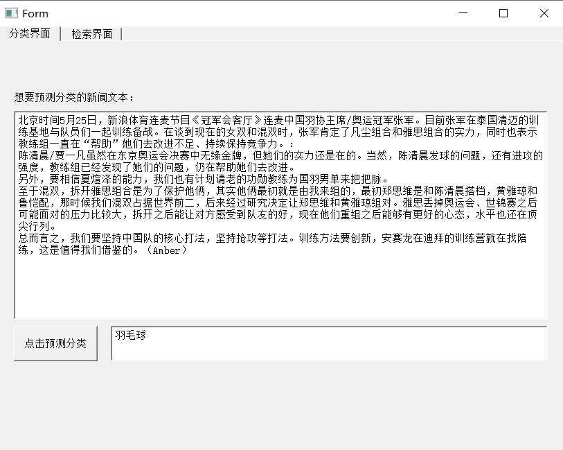

case2:

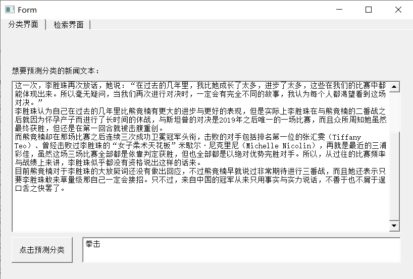

case3:

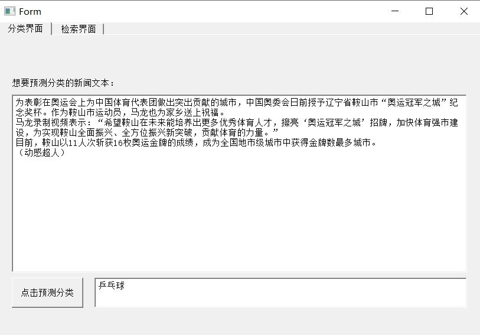

case4:

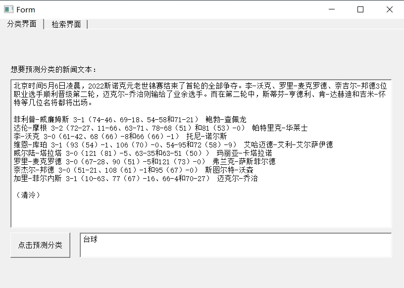

case5:

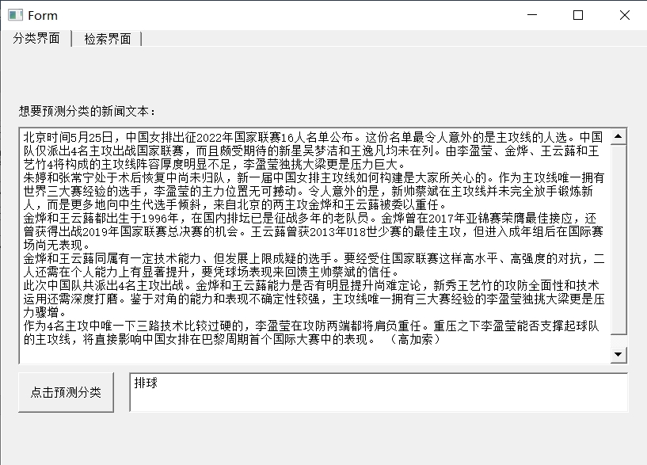

#### 4.3.2 搜索页面测试数据

case1：先输入文本搜索“羽毛球选手”，点击文本搜索按钮。

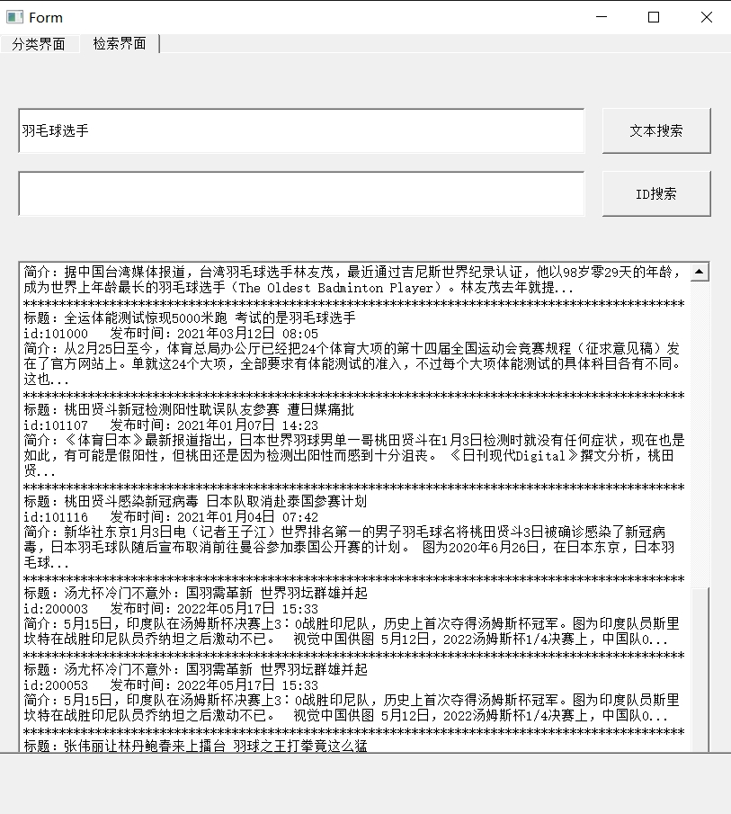

在得到的记录中选择感兴趣的新闻ID输入ID搜索框中，点击ID搜索按钮获取全文展示。

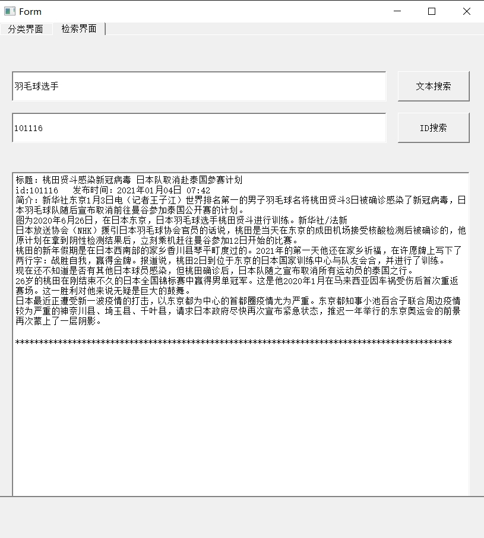

case2:文本框输入 “台球比赛” 点击文本搜索按钮

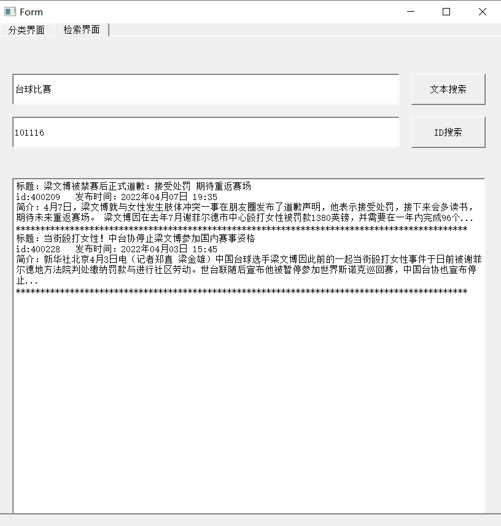

选择id 400209 点击ID搜索按钮

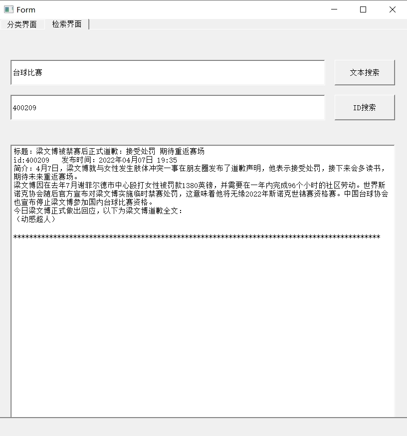

## 5 总结

本项目采用深度学习的方法，构建神经网络模型，解决新闻的多分类问题，最终使模型准确率达到95%以上，完成了预设目标，最后简单小结一下本项目带来的收获与项目的局限性。

### 5.1 收获

- 为了获取新闻数据，小组成员爬取了新浪体育网的数千条数据，在此过程中，我们对爬虫的原理和技术都有了更深入的了解，也更加熟悉了通过http协议浏览器获取服务端资源的方式。同时，在解析网页过程中，我们学习和使用了 xpath 技术，熟悉了 xml 格式文本保存信息的方式和特点和解析 xml 文本的技术手段。
- 为了存储新闻数据，小组成员将 sqlite 数据库作为信息存储的载体，通过项目实践，我们对 SQL 语句的编写愈加熟练，并且在实际使用数据的过程中感受到了数据库存储数据对比普通文件存储数据的优越性。
- 在进行模型构建的过程中，我们了解了神经网络模型的原理，也熟知了神经网络各个层的功能和作用，尤其是添加了在Embedding层，整个模型的准确率达到了质的飞跃，使我们切身感受到了 word2vec 技术的效果和重要性。除此之外，我们对 LSTM 模型也有了一定程度的了解。
- 模型封装部分，我们学习了 PySide2 可视化模块和 QtDesigner 的基本控件使用方法；在完成界面ui设计后，我们编写了界面中的操作代码，在这个过程中，熟练掌握了事件连接、数据库连接、预测分类数据处理和模型调用、基本文本接收展示控件的使用、模糊匹配等知识。
- 最后，通过整个项目实践，小组成员的编程水平，自学能力，团队合作意识，项目流程管理和把控能力以及通过程序解决实际问题的能力都得到了巨大提升。

### 5.2 局限性与展望

- 本项目的预测类别较少，数据量也不大，后续可增加数据量和类别，进一步完善该模型的功能。
- 本项目使用的是sqlite数据库，对于本项目的规模来说，虽然完全能够符合要求，但是如果后续要大幅度拓展数据量，或者数据库有着高并发处理的需求的话，中大型数据库或许是更好的选择。
- 本项目在爬取数据中出现了一些与预期不一致的结果，即表的id不是完全连续的，部分地方出现断点，原因可能是多线程的爬取的同步问题，后续可以尝试通过上锁等方法处理这一问题。
- 本项目除了完成预定的分类功能之外，还拓展了数据检索功能，但是限于时间和技术水平，只是简单借助于SQL的模糊匹配，检索的功能比较弱，也不能判断查询语句和文档的相关性，后续改进可以参考搜索引擎的相关技术 。
- 本项目的代码架构还有较大的提升空间，不同模块之间存在耦合，程序的健壮性也有待提升。
